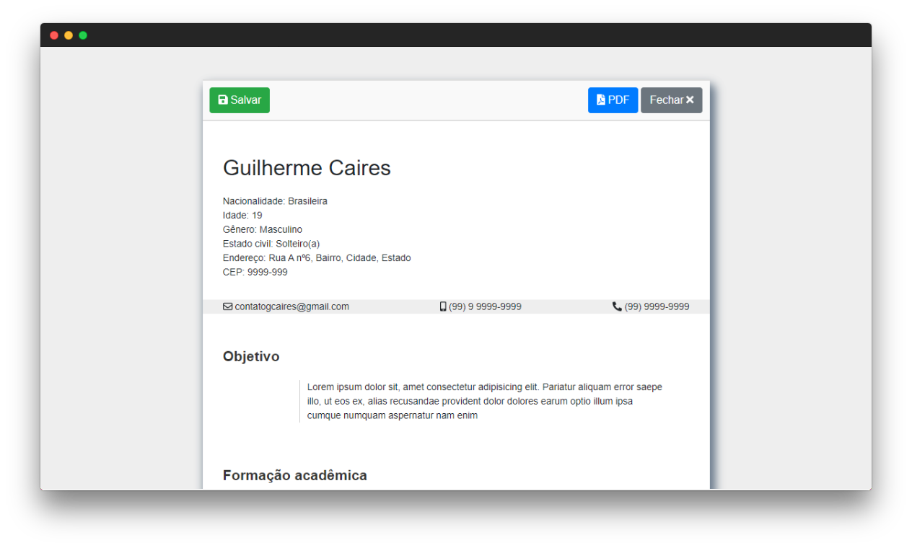

# JS Curriculum Generator
> Gerador de curriculum vitae através de uma simples página HTML. 

Teste em um click: https://gcairesdev.github.io/js-curriculum-generator/ 

<p align="center">
    
</p>



## Instalação

Todos os sistemas operacionais:

```sh
git clone https://github.com/gcairesdev/js-curriculum-generator
```

_ou_

faça o download em um <a href="https://github.com/gcairesdev/js-curriculum-generator/archive/master.zip" target="_blank">click</a>.

## Autores

Foto | Nome | GitHub | Likedin | E-mail
---- | ---- | ------ | ------- | ------
 | Guilherme Caires | [gcairesdev](https://github.com/gcairesdev) | [Linkedin](https://linkedin.com/in/guilherme-caires/) | contatogcaires@gmail.com
 | Jefferson Eloy | [jeffeloy](https://github.com/jeffeloy) | [Linkedin](https://linkedin.com/in/jefferson-eloy) | contatojeloydev@gmail.com

## Contribuição

1. Faça o fork (<https://github.com/gcairesdev/js-curriculum-generator/fork>)
2. Crie a branch da sua modificação (`git checkout -b feature/modelos-cv`)
3. Commit suas mudanças (`git commit -am ':rocket: Add mais modelos de cv'`)
4. Faça push para sua branch (`git push origin feature/modelos-cv`)
5. Crie um Pull Request

### Commit 

- Usar modo imperativo ("Adiciona feature" não "Adicionando feature" ou "Adicionada feature")
- Primeira linha deve ter no máximo 70 caracteres
- Considere descrever com detalhes no corpo do commit
- Obrigatório usar um emoji no início da mensagem de commit

Emoji | Código | Tipo do commit
------------ | ------------- | -------------
:tada: | `:tada:` | initial commit
:art: | `:art:` | quando melhorar a estrutura/formato do código
:racehorse: | `:racehorse:` | quando melhorar a performance
:memo: | `:memo:` | quando escrever alguma documentação
:bug: | `:bug:` | quando corrigir um bug
:fire: | `:fire:` | quando remover código ou arquivos
:lock: | `:lock:` | quando melhorar a segurança
:poop: | `:poop:` | deprecated
:construction: | `:construction:` | em construção
:rocket: | `:rocket:` | nova feature
:see_no_evil: | `:see_no_evil:` | gambiarra
:gift: | `:gift:` | nova versão 

### Exemplo
```bash
git commit -m ":memo: Adiciona instruções de contribuição
>
> Foi criado o arquivo README.md com as instruções de
> como fazer um bom commit
``` 
